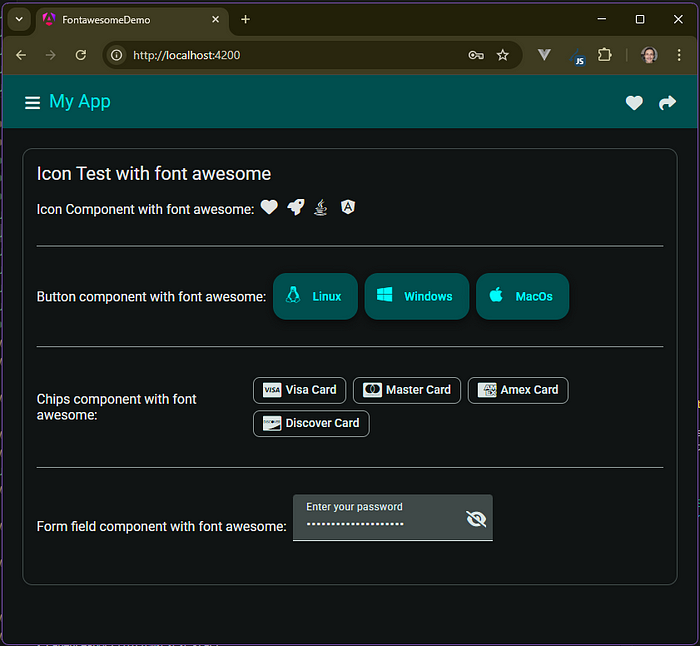

# Fontawesome Demo

Angular Material + Font Awesome Starter (Standalone)

## Getting Started

1. Clone the repository
```bash
git clone https://github.com/Carlos-Henreis/fontawesome-demo
cd fontawesome-demo
```
2. Install dependencies
```bash
npm install
```
3. Run the application
```bash
npm start
```
4. Open your browser and navigate to `http://localhost:4200`

